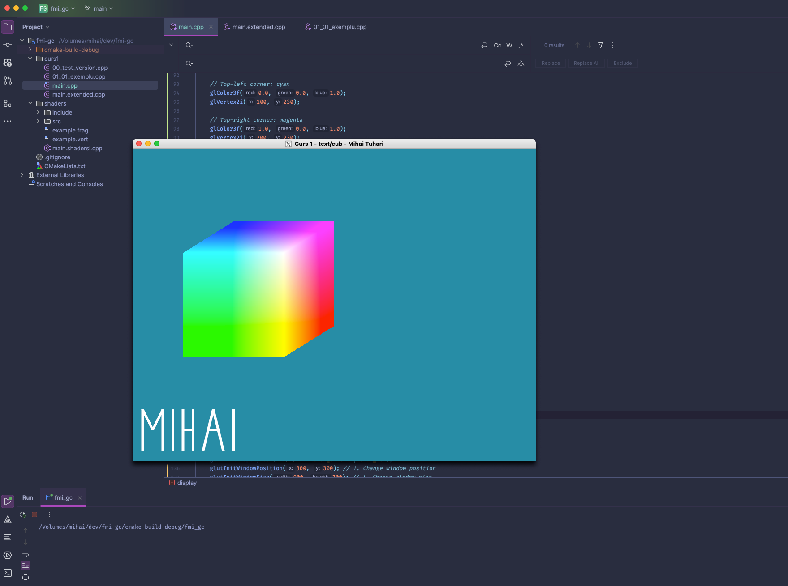

## Tema 1. Start in lucrul cu OpenGL.

### Cerinta
Solutiile vor fi trimise pe chat-ul individual de pe MSTeams pana pe 11.11.2024. Trimiteti o imagine care sa includa (i) rezultatul, (ii) fragmentul de cod sursa relevant.
1) Creati un proiect folosind Microsoft Visual Studio. Verificati, pe rand, codurile sursa din sectiunea Resurse Laborator (Inlocuiti main.cpp cu fiecare dintre fisiere. Nu uitati ca trebuie sa aveti un singur fisier .cpp activ in Source files, pentru a elimina codul deja rulat – click dreapta pe numele fisierului, alegeti Exclude from project).
2) (1p) Modificati in codul sursa 01_01_exemplu.cpp urmatoarele elemente: dimensiunea si pozitionarea ferestrei de vizualizare; ; tipul / culorile primitivelor reprezentate (de exemplu desenati un triunghi);
3) (1p) Folositi segmente de dreapta pentru a afisa data / alt text.
4) (1p, suplimentar) Realizati o reprezentare 2D simplificata a cubului RGB (puteti utiliza si aceasta resursa).

### Rezolvare
Fisierul [laborator1/main.cpp](main.cpp)

