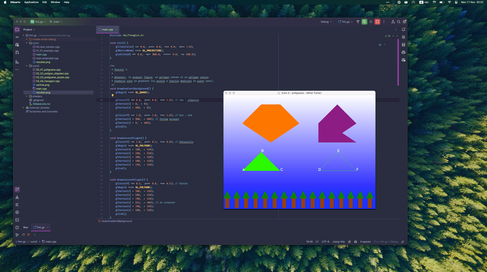

## Tema 2 / Primitive grafice.

### Cerinta
Solutiile vor fi trimise pe chat-ul individual de pe MSTeams pana pe 18.11.2024. Trimiteti o imagine care sa includa (i) rezultatul, (ii) fragmentul de cod sursa relevant.

1) (1p) Desenati, in aceeasi figura, un poligon convex si un poligon concav. Fundalul este un gradient (nu exista o functie dedicata in acest sens).
2) (1p) Desenati, in aceeasi figura, un triunghi **ABC** vazut din fata si un triunghi **DEF** vazut din spate. Triunghiul vazut din fata este desenat cu modul `GL_FILL`, cel vazut din spate cu modul `GL_LINE` – folositi functii dedicate ale OpenGL. Indicati, cu litere, varfurile triunghiurilor pe figura.
3) (1p) Creati un model (desen) 2D mai complex, folosind diverse tipuri de primitive grafice (inclusiv liste de display, ca in codul `02_04_hexagon.cpp`).

### Rezolvare
Fisierul [laborator2/main.cpp](main.cpp)

